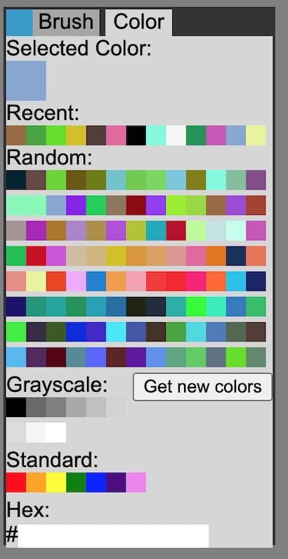

<b>Javascript Paint Program</b>

A javascript paint program I wrote when I was 15. Works best in Google Chrome. Doesn't work in firefox.  

<b>Toolbox</b>  
It is possible to change between two toolbox tabs; brush and colour. The brush tab allows the brush size to be modified and gives a preview, whereas the colour tab enables a range of standard and personalised hex brush colours to be chosen from. (I wrote colour without a u lol. When coding it's just easier to stick to US spellings)   

 

<b>Canvas</b>  
Canvas size can be adjusted using the blue arrows on the edges of the canvas, or by manually inputting width and height pixel values in the boxes at the bottom left of the screen. The canvas can be cleared by clicking on the Clear Canvas button located at the bottom right of the screen.  
 

<b>Moving the Toolbox</b>  
Moving the toolbox is very simple. You just click on the blue box at the top left of the toolbox. The mouse arrow will transform into four arrows, indicating that the toolbox can be freely repositioned anywhere on the screen.  

